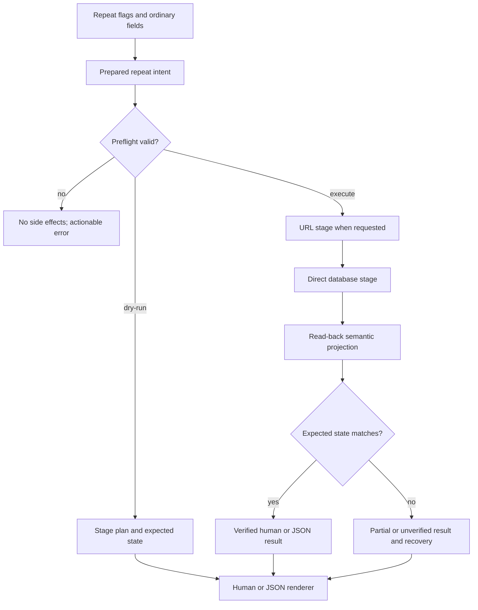
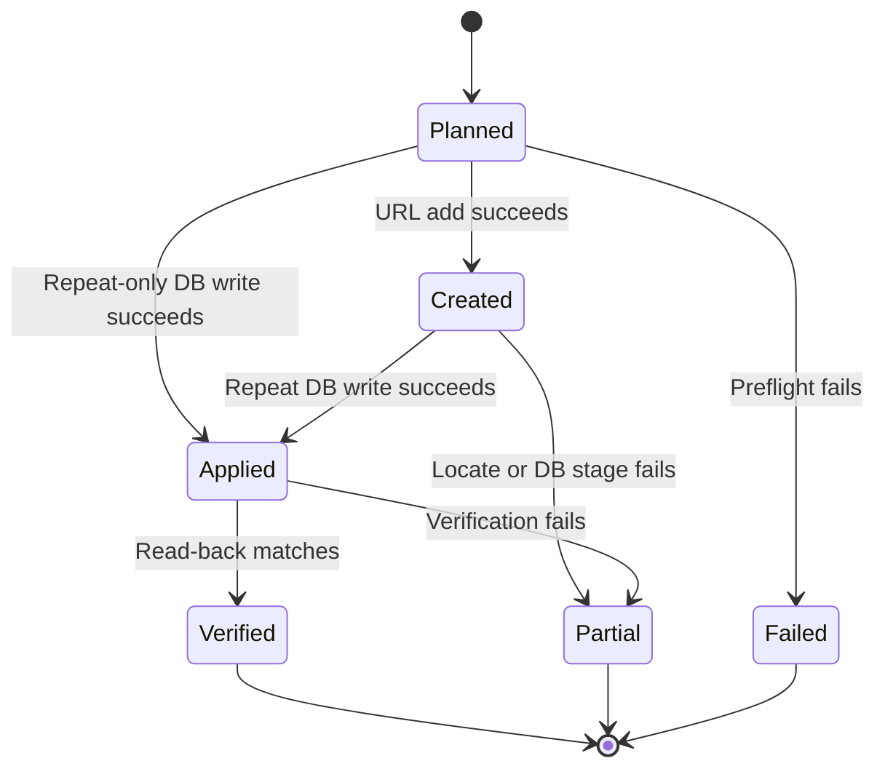

# Agent-Safe Repeat Workflows - Plan

## Goal Capsule

- **Objective:** Make repeat todo operations truthful, self-verifying, recoverable, and easy for agents to use without mistaking process success for an activated Things template.
- **Authority:** The confirmed full-scope improvement request governs behavior; repository instructions and current Things database compatibility govern implementation details.
- **Execution profile:** Standard-depth CLI and agent-skill change spanning persistent-state verification, public output contracts, static documentation, and a secondary skill mirror.
- **Stop conditions:** Stop rather than guessing if live Things behavior contradicts the planned activation or clear-state invariants, or if a combined update cannot safely target one template across both write stages.
- **Tail ownership:** The shipping workflow owns implementation, regression coverage, cross-repository skill synchronization, review, commits, pull requests, and CI.

---

## Product Contract

### Summary

Repeat-bearing `add` and `update` commands will validate every knowable failure before mutation, describe every stage during dry-run, verify the resulting hidden template after a database write, and return stable human or JSON results with the relevant UUIDs.
Agents will be able to independently re-read effective repeat semantics through `things templates`, follow a UUID-first workflow in the Things skill, and recover safely when the URL-scheme and direct-database stages only partially complete.

### Problem Frame

The current command path can exit successfully after a direct database update without proving that Things recognizes an active template.
Repeat adds and combined updates are multi-stage, non-atomic operations, yet success is silent and failures do not consistently reveal which state changes already happened.
The global dry-run prints only the URL stage and says repeat processing was skipped, so it cannot validate or preview the most consequential part of the request.
Static help and the mirrored agent skill have also drifted, including unsupported repeat flags on `add-project` and an obsolete skill path.

### Actors

- A1. **Human CLI user** wants the requested repeat behavior to be applied or a precise explanation of what remains.
- A2. **Using agent** needs stable identifiers, normalized semantics, machine-readable state, and recovery instructions instead of inferring success from exit code alone.
- A3. **Maintainer** needs one canonical skill source, deterministic drift checks, and testable documentation contracts.

### Requirements

**Mutation safety and lifecycle**

- R1. Repeat-bearing commands must parse, normalize, and semantically validate the complete recurrence specification before any URL launch or database mutation.
- R2. Repeat-bearing commands must preflight the required database path, schema capabilities, target state, and authentication requirements before the first mutation whenever those checks are knowable in advance.
- R26. Writable repeat operations must canonicalize the database target, reject unsafe symlink or non-regular-file targets, verify a recognized Things database shape, and report whether selection came from discovery, `THINGSDB`, or `--db`.
- R3. Repeat add, update, and clear must re-read the resolved target after persistence and report success only when the expected repeat state matches.
- R4. Applying a repeat rule must verify recurrence presence, scheduled active core state, non-paused creation state, and the mode-appropriate recurrence dates; clearing must verify recurrence absence under its separate post-state contract.
- R5. A database update that affects no target row must fail rather than report success.
- R6. Combined ordinary-field and repeat updates must operate on one resolved template target or reject the operation before mutation when the Things URL scheme cannot safely update that template.
- R7. Predictable preflight failures must perform no writes and must not launch Things.
- R8. Failures after a completed URL stage must report partial completion, completed and failed stages, every trustworthy UUID, and an idempotent UUID-first recovery path without claiming rollback.
- R27. Recovery guidance must preserve shell argument boundaries, prefer UUID-only commands, and avoid emitting executable title-based commands when identity is ambiguous.
- R9. Title-based creation lookup must never guess among multiple candidates; timeout or ambiguity must be reported as partial completion because the URL add may already have created an ordinary todo.

**Preview and output contracts**

- R10. Repeat dry-run must validate and describe every requested URL and database stage while performing zero writes and zero application launches.
- R11. Dry-run must show normalized repeat mode, unit, interval, anchor, end date, deadline offset, expected activation state, and target resolution when an existing target can be resolved.
- R12. Repeat-bearing `add` and `update` must support a concise human result and one stable JSON object containing the action, requested and resolved IDs, normalized recurrence semantics, ordered stage outcomes, partial state, and verification result.
- R13. JSON stdout must remain parseable and free of diagnostics; warnings and conventional command errors remain on stderr, while a partial result may be emitted on stdout before the command returns non-zero.
- R14. Output must distinguish the requested UUID, newly created todo UUID, and resolved template UUID, and must not claim a future occurrence was spawned when only template persistence was verified.
- R15. Recovery output and dry-run URLs must redact auth tokens.
- R28. Repeat results must exclude raw recurrence plist data, task notes, and other database content not required to identify or recover the requested operation.

**Independent reads and semantics**

- R16. The template read surface must expose canonical repeat semantics and verification-relevant state: template UUID, active or paused state, mode, unit, interval, anchor, next date, stop date, deadline offset, and core scheduled state.
- R17. Human write results, JSON write results, and template reads must use one semantic projection so their vocabulary and values cannot drift.
- R18. Unknown or corrupt recurrence rules must leave templates listable and expose a decode warning rather than failing the entire result set.
- R19. Accepted parser aliases may remain supported, but all output and documentation must use the canonical `after-completion`, `schedule`, `day`, `week`, `month`, and `year` vocabulary.

**Documentation and agent guidance**

- R20. `add-project` help and man pages must stop advertising repeat flags and must state that repeating projects are unsupported.
- R21. Help, README, and the Things skill must explain repeat modes by human intent, distinguish the anchor from ordinary scheduling, explain repeat deadline offsets, and describe dry-run and post-write verification.
- R22. Authentication guidance must distinguish URL-scheme updates, direct repeat database writes, read-only database access, and commands that require both auth and Full Disk Access.
- R23. The Things skill must teach a read, identify, preview, write, verify, report workflow that prefers UUIDs and includes partial-failure recovery.
- R24. `skills/things/SKILL.md` must be the canonical skill content and must stay synchronized with the active `agent-scripts` repository copy through an explicit sync command plus a scheduled or manually dispatched cross-repository drift check that fetches both artifacts.
- R25. Repository instructions and README must reference the active `agent-scripts/skills/things/SKILL.md` location rather than the removed archived location.

### Key Flows

- F1. **Create a repeating todo**
  - **Trigger:** A1 or A2 invokes `things add` with repeat flags.
  - **Steps:** Validate and preflight, preview or create through the URL scheme, locate the created UUID, apply the repeat rule, re-read the template, then render the result.
  - **Outcome:** Success includes created and template identity plus verified semantics; a later-stage failure reports the possible ordinary todo and recovery command.
  - **Covered by:** R1-R5, R7-R15.
- F2. **Update or clear a repeat rule**
  - **Trigger:** A1 or A2 invokes `things update --id` with repeat flags.
  - **Steps:** Resolve any generated instance to its hidden template, validate target state, preview or mutate, re-read the same UUID, then render applied or cleared state.
  - **Outcome:** The reported template state matches the requested recurrence or verified clear contract.
  - **Covered by:** R1-R5, R10-R19.
- F3. **Combine ordinary and repeat changes**
  - **Trigger:** An update includes URL-scheme fields and repeat flags.
  - **Steps:** Resolve one effective target, preflight both auth and database requirements, preview both stages, then execute and verify them in order.
  - **Outcome:** Both stages target the template or the command rejects the unsafe combination before mutation.
  - **Covered by:** R2, R6-R8, R10-R15, R22.
- F4. **Agent independently verifies state**
  - **Trigger:** A2 receives a successful or partial mutation result.
  - **Steps:** Use the resolved UUID with the semantic template read surface, compare effective intent, and report exact state or recovery.
  - **Outcome:** Verification does not depend on parsing raw plist fields or trusting the earlier process exit alone.
  - **Covered by:** R16-R19, R23.

### Acceptance Examples

- AE1. **Scheduled repeat activation**
  - **Given:** A Someday todo and a valid daily schedule rule.
  - **When:** The rule is applied.
  - **Then:** Exactly one row is affected and read-back shows recurrence present, `start=2`, `startBucket=0`, creation not paused, canonical schedule semantics, and the expected next date.
- AE2. **After-completion nuance**
  - **Given:** A valid weekly after-completion rule.
  - **When:** It is applied and verified.
  - **Then:** Verification accepts the mode's legitimate absence of a fixed next-instance date while still proving an active non-paused template.
- AE3. **Truthful repeat preview**
  - **Given:** A repeat add with an explicit anchor and deadline offset.
  - **When:** It runs with `--dry-run --json`.
  - **Then:** One JSON object describes planned URL and database stages, normalized dates and expected state, uses no fabricated UUID, launches nothing, and performs no writes.
- AE4. **Partial add recovery**
  - **Given:** The URL add succeeds but locating, applying, or verifying the repeat stage fails.
  - **When:** The command exits non-zero.
  - **Then:** Output states that a non-repeating todo may remain, identifies completed and failed stages, includes the UUID when known, and gives safe retry or disambiguation guidance.
- AE5. **Generated-instance update**
  - **Given:** The supplied UUID belongs to a generated occurrence linked to a hidden template.
  - **When:** Repeat fields are updated.
  - **Then:** Preview and execution report both supplied and template UUIDs, and no ordinary-field stage silently targets a different record.
- AE6. **Independent semantic parity**
  - **Given:** A successful repeat write result.
  - **When:** The template is subsequently read as JSON.
  - **Then:** Its canonical semantic projection matches the result's repeat state and does not claim occurrence creation.
- AE7. **Unsupported project recurrence stays undiscoverable**
  - **Given:** A user requests `things help add-project` or reads the man page.
  - **When:** They inspect supported flags.
  - **Then:** No repeat flags are advertised and repeating projects are identified as unsupported.

### Scope Boundaries

**In scope**

- Repeat todo add, update, and clear behavior, including combined ordinary-field updates.
- Human and JSON mutation results for repeat-bearing `add` and `update` commands.
- Semantic repeat state on template reads across supported output formats.
- Static help, README, man source, installed man artifact, repository instructions, canonical skill content, mirror tooling, and CI checks.

**Deferred to Follow-Up Work**

- General structured mutation results for non-repeat add, update, delete, project, and area commands.
- Durable undo or action-log rollback for direct repeat database writes.
- A command-wide JSON error envelope beyond repeat partial-result reporting.

**Outside this product change**

- Repeating projects or multi-day weekly recurrence patterns.
- Automating macOS Full Disk Access, Things automation permission, or other human-owned system prompts.
- Claiming that Things has spawned a future occurrence when the CLI verified only template persistence.

---

## Planning Contract

### Key Technical Decisions

- KTD1. **Extend the existing `add` and `update` command family.** (session-settled: user-approved — chosen over a separate repeat-management command family: preserving current commands keeps repeat operations discoverable while shared internals remove duplication.)
- KTD2. **Ship the full runtime and guidance improvement set.** (session-settled: user-approved — chosen over a documentation-only correction: silent and unverified writes are the primary agent-error source.)
- KTD3. **Keep repeating projects unsupported.** (session-settled: user-approved — chosen over expanding recurrence to projects: the request is safety and clarity for the existing todo capability.)
- KTD4. **Prepare recurrence intent once before mutation.** Parsing, semantic validation, normalized display values, persistence input, expected verification state, and recovery flags derive from one prepared representation.
- KTD5. **Use a shared semantic projection for writes and reads.** A typed repeat-state model will decode database metadata into canonical values and will carry a warning for unknown rules instead of making raw plist the agent contract.
- KTD6. **Treat verification as database read-back, not occurrence creation.** Apply verification checks exactly one affected row, recurrence presence, scheduled active state, non-paused creation, semantic equality, deadline state, and mode-specific dates; clear verification checks recurrence absence and reports the remaining ordinary scheduling state.
- KTD14. **Use an independent Things-created fixture oracle.** Shared projection parity is necessary but not sufficient, so known raw columns and semantic meaning from Things-created repeat records independently constrain decoder, write-result, and template-read tests.
- KTD7. **Preserve current clear compatibility until live proof says otherwise.** Clearing removes recurrence metadata and its repeat-owned deadline while leaving the todo's resulting core scheduling fields visible in output; it does not promise restoration of pre-repeat fields.
- KTD8. **Use one stage-aware result model.** Human and JSON renderers consume the same action, IDs, prepared semantics, ordered stage statuses, changed state, partial flag, verification evidence, and recovery data.
- KTD9. **Expose `--json` on repeat-bearing writes.** A repeat-bearing command emits one JSON object to stdout; using the flag without repeat work is rejected until general write-result JSON is designed.
- KTD10. **Emit partial JSON before a non-zero exit when intent is incomplete.** Preflight errors keep the conventional stderr-only error path, while failures after mutation may emit one parseable partial result on stdout and the final diagnostic on stderr.
- KTD11. **Dry-run mirrors execution without side effects.** It uses the same prepared intent and result vocabulary, performs read-only resolution for existing targets, represents future add IDs as unavailable, redacts secrets, and never opens a writable transaction or launches Things.
- KTD12. **Resolve combined updates to one effective target before the URL stage.** If the URL scheme cannot reliably update a hidden template, reject a combined generated-instance update and provide separate UUID-first commands rather than splitting state across two rows.
- KTD15. **Reject combined generated-instance updates by default.** Enable template retargeting only after a live Things test proves the URL stage changes the resolved hidden template and leaves the supplied occurrence unchanged; preserve that behavior as a release gate.
- KTD13. **Make the repository skill canonical and verify it across repositories.** `skills/things/SKILL.md` is copied explicitly to the secondary `agent-scripts` repository; local check mode reports drift when the sibling checkout is present, while a scheduled or manually dispatched workflow fetches both main-branch artifacts so cross-repository equality does not depend on adjacent checkouts.

### High-Level Technical Design

### Implementation Constraints

- Preserve stdout for primary output and stderr for diagnostics; JSON tests must parse complete stdout rather than substring-match prose.
- Canonicalize and identify the writable database path before mutation, reject symlinked or non-regular targets, and never expose more path or database content than the operation result needs.
- Render recovery from structured arguments with shell-safe quoting; when no UUID is trusted, emit a non-executable read and disambiguation workflow rather than interpolating an untrusted title into a command.
- Keep database verification minimal enough to tolerate Things schema versions while failing clearly when required repeat columns are unavailable.
- Use bounded polling where Things updates are asynchronous; distinguish write-applied from verification-failed so blind retries are not encouraged.
- Normalize dates in local time and pin explicit dates or time zones in tests to avoid midnight-dependent failures.
- Preserve `--repeat-deadline=0` as an explicitly supplied value.
- Reject ambiguous combinations such as fixed `--deadline` with `--repeat-deadline`; explain that `--when` schedules an ordinary todo while `--repeat-start` anchors recurrence.
- Do not auto-delete a todo or promise rollback after partial creation.

### System-Wide Impact

- **Persistent state:** Repeat writes modify Things SQLite rows directly; affected-row checks and read-back become part of correctness.
- **Agent contract:** JSON field names, stage vocabulary, IDs, and canonical recurrence terms become public automation contracts.
- **Cross-interface parity:** The write result and later `templates` read must describe the same hidden template state.
- **Authentication:** Pure repeat database work needs writable database access; ordinary URL updates need a token; combined updates need both.
- **Documentation:** Static help, two man representations, README, repository instructions, and two skill repositories must move together.

### Risks and Mitigations

- **Things schema drift:** Query only required columns, return a capability-specific error, and keep fixture coverage aligned with real fields.
- **Two-stage partial completion:** Preflight predictable failures, preserve stage truth, return trusted IDs, and provide idempotent recovery rather than rollback claims.
- **Immediate read-back can be overwritten by Things:** Treat automated read-back as persistence proof, then require a live smoke to re-observe the state after a bounded Things settle or reload cycle before declaring the runtime contract proven.
- **Title lookup ambiguity:** Never guess; report candidates or a read/disambiguation workflow when identity is not trustworthy.
- **Direct database races:** Use a guarded repeat-column transaction, inspect affected rows, and perform a bounded read-back; report lock failures without unbounded retries.
- **Cross-repository drift:** Provide explicit check and sync modes, keep normal PR CI green when the sibling repo is absent, verify both published main-branch artifacts in a scheduled or manually dispatched workflow, and update the secondary repository in its own commit and PR.
- **Private secondary repository access:** The published-artifact workflow uses a dedicated read-only GitHub credential stored as an Actions secret; it must not reuse a broad write-capable maintainer token, and missing credentials must fail with setup guidance rather than appear as skill drift.

---

## Implementation Units

### U1. Model and verify effective repeat state

- **Goal:** Establish one prepared recurrence intent and one database-backed semantic state model for persistence, reads, and verification.
- **Requirements:** R1-R5, R16-R19, R26; KTD4-KTD7, KTD14.
- **Dependencies:** None.
- **Files:** `internal/repeat/repeat.go`, `internal/repeat/repeat_test.go`, `internal/db/repeat.go`, `internal/db/repeat_test.go`, `internal/db/models.go`.
- **Approach:** Add canonical semantic fields and decoding around the existing recurrence plist, expose a minimal repeat-state read query, inspect affected rows on apply and clear, and compare read-back against mode-specific expected state. Keep the current `start=2` and `startBucket=0` activation fix as the regression baseline. Treat clear as its own contract and make unknown rules inspectable with warnings. Add Things-created reference records whose raw columns and known meaning act as an oracle independent of the shared decoder.
- **Execution note:** Strengthen the existing repeat persistence test first so activation, after-completion nuance, clear behavior, missing rows, and decode failures prove the old gaps before production changes expand.
- **Patterns to follow:** `RepeatTargetByID` and `RepeatUpdate` in `internal/db/repeat.go`; canonical parsing and plist construction in `internal/repeat/repeat.go`; nullable field handling in `internal/db/queries.go`.
- **Test scenarios:**
  - Covers AE1. Applying a daily schedule to a Someday fixture affects one row and reads back active scheduled, non-paused, semantically equal state with the expected next date.
  - Covers AE2. Applying a weekly after-completion rule verifies successfully with no fixed next-instance date.
  - Applying interval, end-date, and deadline offsets of nil, zero, and positive values round-trips to canonical semantic fields.
  - Clearing a repeating template removes recurrence metadata and the repeat-owned deadline, reports the resulting ordinary scheduling fields, and does not apply activation assertions.
  - Applying or clearing a missing UUID returns a no-row error instead of apparent success.
  - A corrupt or unsupported recurrence plist yields a listable state with a decode warning.
  - Things-created schedule and after-completion reference records assert raw required columns and known semantics independently before write and read projections are compared.
- **Verification:** Database tests prove persistence and read-back invariants for apply and clear, and repeat-package tests prove canonical normalization without relying on current time.

### U2. Add stage-aware repeat previews and results

- **Goal:** Define one agent-facing operation lifecycle and render it consistently as human text or JSON.
- **Requirements:** R10-R15, R17-R19, R27-R28; KTD8-KTD11.
- **Dependencies:** U1.
- **Files:** `internal/cli/repeat_flags.go`, `internal/cli/repeat_helpers.go`, `internal/cli/repeat_output.go`, `internal/cli/repeat_output_test.go`, `internal/cli/root.go`.
- **Approach:** Build a prepared operation before command branching, record ordered stages and distinct requested, created, and template identities, add repeat-scoped `--json`, and render normalized semantics plus verification or recovery from a shared result type. Human dry-run includes the redacted URL stage and expected database stage; JSON dry-run emits one object with unavailable future IDs represented honestly.
- **Execution note:** Start with output-contract tests that parse JSON and assert stdout/stderr separation before integrating command execution.
- **Patterns to follow:** Output option validation in `internal/cli/taskoutput.go`, JSON encoding in `internal/cli/dboutput.go`, URL token redaction in `internal/cli/openurl.go`, and Cobra flag registration in `internal/cli/taskflags.go`.
- **Test scenarios:**
  - Covers AE3. Repeat add dry-run with explicit dates renders every planned stage and expected state, performs no launch or write, and emits valid JSON when requested.
  - Human success leads with the action, trusted UUIDs, canonical recurrence summary, and verified state.
  - JSON success contains one object with a schema version, canonical action and stage values, normalized repeat fields, IDs, applied state, and verification evidence.
  - Partial JSON remains the only stdout object while the command returns non-zero and writes the final diagnostic to stderr.
  - Auth tokens are absent from human output, JSON output, and recovery commands.
  - Recovery rendering preserves argument boundaries for UUIDs and adversarial titles containing spaces, leading dashes, quotes, newlines, semicolons, backticks, and command substitutions; ambiguous identity produces no executable title command.
  - JSON results omit raw plist, notes, and unrelated database content.
  - `--json` without repeat work fails with actionable scope guidance rather than silently changing ordinary write output.
- **Verification:** Renderer tests lock the public field names and lifecycle vocabulary and prove every JSON path parses as exactly one object.

### U3. Preflight and execute repeat operations safely

- **Goal:** Integrate preparation, target resolution, persistence, verification, and partial-failure recovery into repeat add, update, and clear.
- **Requirements:** R1-R15, R26-R28; F1-F3; KTD4, KTD6, KTD8, KTD10-KTD12, KTD15.
- **Dependencies:** U1, U2.
- **Files:** `internal/cli/add.go`, `internal/cli/add_test.go`, `internal/cli/update.go`, `internal/cli/update_test.go`, `internal/cli/repeat_helpers.go`, `internal/cli/dbtest_helpers_test.go`.
- **Approach:** Move semantic build and database capability checks before `openURL`, canonicalize and validate the selected database provenance, resolve update targets before either stage, use the prepared persistence input once, then perform bounded verification and render the stage result. Combined generated-instance updates remain rejected until live Things proof establishes safe hidden-template URL targeting. Preserve exact partial state after URL success and return shell-safe UUID-first retry or non-executable disambiguation guidance.
- **Execution note:** Characterize current two-stage behavior, then add failure injection at each boundary before restructuring the commands.
- **Patterns to follow:** Existing `verifyWhenApplied` bounded read-back, `resolveRepeatTarget` generated-instance handling, `waitForCreatedItem` safety behavior, and temp SQLite command tests using `recordLauncher`.
- **Test scenarios:**
  - Invalid interval, end-before-anchor, negative deadline offset, incompatible date flags, missing schema, and unavailable writable DB fail before launcher invocation.
  - Discovered, `THINGSDB`, and `--db` selections report their provenance; symlinked, non-regular, or unrecognized writable targets fail before launcher invocation.
  - Covers AE4. URL add success followed by locate timeout, ambiguous match, apply failure, or verification mismatch returns non-zero stage truth and recovery without deletion.
  - A test launcher inserts the created row synchronously so repeat add human and JSON success can be verified against a temporary writable database.
  - Repeat-only update needs database access but no URL auth token; mixed ordinary and repeat update requires both capabilities.
  - Covers AE5. A generated-instance UUID resolves before dry-run and execution, reports both IDs, and either updates one template across stages or rejects before mutation.
  - Combined generated-instance updates remain rejected until a live test proves the URL stage changes the hidden template and leaves the occurrence unchanged.
  - Repeat clear is idempotent, verifies recurrence absence, and accurately reports unchanged versus changed state.
  - Database lock and unsupported-schema errors name the failed stage and do not retry without bound.
- **Verification:** CLI package tests prove zero-side-effect preflight, full success, generated-template resolution, auth capability splits, and every partial boundary with temporary databases.

### U4. Expose semantic repeat state on template reads

- **Goal:** Let agents independently inspect the same effective template state returned by repeat writes.
- **Requirements:** R16-R19; F4; KTD5-KTD6.
- **Dependencies:** U1.
- **Files:** `internal/db/models.go`, `internal/db/queries.go`, `internal/db/queries_test.go`, `internal/cli/taskoutput.go`, `internal/cli/taskoutput_test.go`, `integration/db_helpers_test.go`, `integration/list_commands_test.go`, `integration/tasks_json_test.go`.
- **Approach:** Thread the semantic repeat projection through template queries and supported output formats. Keep generic task tables compact, make template output useful for verification, expose semantic fields to `--select`, and retain corrupt templates with warning metadata.
- **Execution note:** Add query and output coverage before changing default template presentation so null, unknown, and canonical values remain intentional.
- **Patterns to follow:** Shared task select and scan pipeline in `internal/db/queries.go`, selectable field aliases in `internal/cli/taskoutput.go`, and the Today ordering field integration covered by the prior plan.
- **Test scenarios:**
  - Covers AE6. A written template's JSON semantic state matches the repeat operation result for the same UUID.
  - Table, JSON, JSONL, and CSV expose canonical repeat mode, unit, interval, anchor, end, deadline offset, active state, and next date with consistent null behavior.
  - `--select` supports the new semantic fields without changing existing field names or generic task defaults.
  - A corrupt rule remains present in list output with a decode warning and does not prevent other templates from rendering.
  - Output never equates template verification with generated-occurrence creation.
- **Verification:** Store, formatter, and integration fixtures agree on semantic values across all supported read formats.

### U5. Correct CLI help and user documentation

- **Goal:** Make every human-facing reference describe the supported repeat capability, permissions, and recovery behavior accurately.
- **Requirements:** R20-R22, R25; AE7.
- **Dependencies:** U2, U3, U4.
- **Files:** `internal/cli/helptext.go`, `internal/cli/help_test.go`, `README.md`, `doc/man/things.1.md`, `share/man/man1/things.1`, `AGENTS.md`.
- **Approach:** Remove unsupported project-repeat options, document repeat mode by intent, distinguish recurrence anchor and ordinary scheduling, define deadline-offset and clear semantics, describe truthful preview and verification, publish the auth and Full Disk Access matrix, and correct the active mirror path. Keep authored and installed man representations synchronized.
- **Patterns to follow:** Existing detailed add/update help blocks, README repeat overview, and help regression tests in `internal/cli/help_test.go`.
- **Test scenarios:**
  - Covers AE7. `things help add-project` omits repeat flags and explicitly identifies repeating projects as unsupported.
  - Add and update help describe the canonical default mode, fixed schedule alternative, anchor meaning, deadline offset, dry-run, JSON, verification, and partial recovery.
  - Documentation consistently states that repeat-only writes require writable DB access, ordinary URL updates require auth, and combined updates require both.
  - Man source and installed man artifact carry the same repeat capability statements.
- **Verification:** Help tests lock unsupported and required wording, and documentation diff review finds no obsolete archived skill path or contradictory permission guidance.

### U6. Reconcile and enforce the canonical Things skill

- **Goal:** Make the repository's canonical Things skill operationally safe and provide deterministic local and published-artifact drift detection.
- **Requirements:** R23-R25; A2-A3; KTD13.
- **Dependencies:** U3, U4, U5.
- **Files:** `skills/things/SKILL.md`, `scripts/sync-things-skill.sh`, `scripts/check-things-skill-sync.sh`, `Makefile`, `.github/workflows/ci.yml`, `.github/workflows/skill-sync.yml`.
- **Approach:** Merge useful guidance from both current copies into the repository canonical file, lead with the read-identify-preview-write-verify-report workflow, add intent-based repeat examples and recovery, then provide explicit local check and sync modes. Sync resolves both repository roots, proves the exact destination identity, rejects symlinks in the destination chain, and replaces the mirror atomically from a same-directory temporary file. Normal CI validates the canonical artifact without assuming an adjacent checkout. A scheduled or manually dispatched workflow uses a dedicated read-only Actions secret to fetch the private secondary repository and compare its active mirror byte-for-byte with the canonical main-branch artifact.
- **Execution note:** Snapshot both skill copies before reconciliation, then test the resulting guidance with realistic agent prompts or a focused checklist so safety wording changes are behavioral rather than cosmetic.
- **Patterns to follow:** Existing skill organization and examples, the prior Today-order plan's cross-repository synchronization boundary, and repository shell-script conventions under `scripts/`.
- **Test scenarios:**
  - The canonical skill directs ambiguous writes to read and capture a UUID before mutation.
  - Repeat workflow examples preview, execute, re-read the resolved template, and report verified semantics.
  - Permission guidance distinguishes read, repeat-only, URL-only, and combined operations.
  - Partial-failure guidance uses trusted UUIDs, avoids rollback claims, and tells the agent how to disambiguate unknown creation identity.
  - Local check mode passes for identical copies, reports a useful diff for drift, and remains CI-safe when the sibling repository is absent.
  - Published-artifact check fetches both repositories and fails with the canonical and mirror locations when their main-branch skills differ.
  - Published-artifact check distinguishes missing or unauthorized read credentials from content drift and never receives a write-capable token.
  - Sync mode targets only the intended active mirror path and never recreates the obsolete archived location.
  - Sync mode refuses a missing or mismatched secondary repository, a symlinked destination chain, and any destination outside the exact active skill path without modifying files.
  - Successful sync uses a same-directory temporary file and atomic replacement so interruption cannot leave a truncated skill.
- **Verification:** Repo-local checks and the published-artifact workflow pass; focused skill scenarios demonstrate the intended UUID-first and post-write-verification behavior.

### U7. Land the active skill mirror

- **Goal:** Update the secondary `agent-scripts` repository to the reviewed canonical Things skill and make its repository ownership explicit.
- **Requirements:** R23-R25; A2-A3; KTD13.
- **Dependencies:** U6.
- **Files:** Secondary `agent-scripts` repository: `skills/things/SKILL.md`.
- **Approach:** Create an isolated secondary-repository branch from current main, apply the canonical skill content byte-for-byte, and open a separate pull request that references the primary repository change. Preserve unrelated dirty changes in the user's primary `agent-scripts` checkout. Merge coordination allows a short expected drift window, while the published-artifact workflow becomes green once both main branches contain the paired content.
- **Execution note:** Treat this as a separate repository delivery with its own diff, commit, push, pull request, and CI result; never fold it into the primary repository commit history.
- **Patterns to follow:** The cross-repository skill delivery boundary in `docs/plans/2026-07-13-001-feat-today-reference-order-plan.md` and the active `agent-scripts` skill layout.
- **Test scenarios:**
  - The secondary diff modifies only `skills/things/SKILL.md` unless that repository has an existing required skill-index check.
  - The mirrored file matches the primary canonical skill byte-for-byte.
  - The secondary repository's existing skill audit or sync tests remain green.
  - The primary published-artifact drift workflow is expected to pass after both paired changes reach main.
- **Verification:** The secondary repository has a separate reviewed commit and pull request, its tests pass, and byte-for-byte parity is proven against the canonical skill.

---

## Verification Contract

| Gate | Applies to | Done signal |
|---|---|---|
| Focused repeat domain and database tests | U1 | Prepared semantics, apply, clear, affected rows, decode warnings, and read-back invariants pass. |
| Focused CLI command and output tests | U2-U3 | Human, JSON, dry-run, preflight, target resolution, partial stages, and stderr/stdout contracts pass. |
| Store and output integration tests | U4 | Template semantics agree across database models, select fields, and table/JSON/JSONL/CSV fixtures. |
| Help and documentation contract tests | U5 | Unsupported project recurrence is absent and repeat/auth/verification language is consistent. |
| Repo-local skill checks | U6 | Canonical guidance passes focused checks and normal CI remains deterministic without a sibling checkout. |
| Published skill parity | U6-U7 | A scheduled or manually dispatched workflow fetches both main-branch artifacts and fails on byte drift. |
| Secondary repository delivery | U7 | The active mirror lands through its own branch, commit, pull request, and passing repository tests. |
| `make test` | U1-U6 | All unit and integration packages pass. |
| `git diff --check` and Go formatting | U1-U6 | No whitespace errors and all Go changes are formatted. |
| Privacy-light live Things smoke | U1-U4 | Temporary clearly named todos prove activation survives a bounded Things settle or reload cycle, semantic read parity, generated-template resolution, combined-target behavior, and clear semantics, then are cleaned up. Missing permissions or token block the runtime contract rather than downgrading it to automated persistence-only proof. |

The live smoke must not substitute for fixture coverage. It resolves Things-owned runtime assumptions that temporary SQLite tests cannot prove, especially activation after Things settles or reloads, hidden-template URL targeting, and post-clear scheduling behavior. If the required permission or token is unavailable, the implementation may report automated persistence coverage but cannot declare the runtime activation contract complete.

---

## Definition of Done

- Repeat apply writes activate a template and are accepted as successful only after bounded semantic read-back.
- Repeat clear has a tested, documented, and truthfully reported post-state contract.
- Repeat add, repeat-only update, mixed update, clear, and dry-run produce coherent human and JSON lifecycle results.
- Every predictable invalid repeat or capability failure occurs before the first mutation or Things launch.
- Every post-mutation failure exposes partial state, trustworthy IDs, and safe recovery without rollback claims.
- Combined updates never silently split ordinary fields and recurrence state across an occurrence and template.
- Combined generated-instance updates stay rejected unless live Things proof establishes safe hidden-template URL targeting without modifying the supplied occurrence.
- Template reads independently expose the same canonical semantic state used by write verification.
- `add-project` no longer advertises unsupported recurrence in help or man documentation.
- README, help, man pages, repository instructions, and both Things skills agree on repeat semantics, permissions, verification, and the active mirror location.
- The canonical skill sync/check path is documented and tested; published main-branch drift is independently detectable without an adjacent checkout.
- The active mirror is delivered through a separate secondary-repository pull request and matches the canonical skill byte-for-byte.
- Full automated tests pass and relevant live Things behavior is smoke-tested after a settle or reload cycle with all temporary items cleaned up; skipped live proof leaves the runtime activation contract incomplete.
- The final diff contains no abandoned experiments, duplicate result vocabularies, obsolete archived mirror paths, or unrelated refactors.
